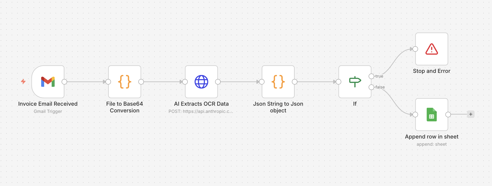

## AI Expense Tracker

Automated expense tracking system built with n8n, Claude AI, and Google Sheets.

## Workflow Architecture

The workflow consists of 6 nodes:
1. **Invoice Email Received** - Gmail trigger watching for emails with attachments
2. **File to Base64 Conversion** - Converts receipt image to base64 format
3. **AI Extracts OCR Data** - Sends image to Claude API for data extraction
4. **Json String to Json Object** - Parses and cleans Claude's response
5. **If** - Validates extracted data, stops if fields are missing
6. **Append row in sheet** - Saves clean structured data to Google Sheets

## How it works
1. Forward receipt images to a designated Gmail inbox
2. n8n detects new emails with attachments
3. Receipt image is sent to Claude API for OCR and data extraction
4. Extracted data (vendor, date, amount, currency, category) is validated
5. Clean structured data is automatically logged to Google Sheets

## Tech Stack
- n8n (workflow automation)
- Claude Sonnet API (AI OCR and categorization)
- Gmail API
- Google Sheets API

## Features
- Automatic receipt processing
- AI-powered expense categorization
- Error handling for invalid receipts
- Supports: Food, Transport, Shopping, Utilities, Health, Entertainment
